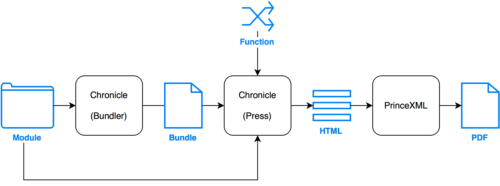

# Chronicle

Create Reports with Web Technologies and run them in Node.

<h1 align="center"></h1><br/>

[](https://www.npmjs.com/package/@panosoft/chronicle)
[](https://travis-ci.org/panosoft/chronicle)

Finally, a reporting engine for JavaScript!

Writing Reports is as easy as writing CommonJS modules (i.e. Node modules) and they can pull data from any source (APIs, SQL Servers, Code data generation, etc.).

The following Web Technologies are supported for use in Reports:

- HTML + Handlebars
- CSS + LESS
- JavaScript + Browserify + npm

<a name="contents"/>
## Contents

- [Architecture](#architecture)
- [Philosophy](#philosophy)
- [Usage](#usage)
- [Examples](#examples)
- [Installation](#installation)
- [Report Structure](#report)
- [CLI](#cli)
- [API](#api)
- [License](#license)

<a name="architecture"/>
## Architecture

[Reports](#report) are CommonJS modules (i.e. Node modules) that export a Report Function.

Report [Functions](#function) accept runtime parameters, retrieve data, and generate HTML.

Chronicle [`bundle`](#bundle) can be used to bundle Reports. Bundling reduces a Report Module, and all of it's dependencies, into a single, portable, version locked file. As such, bundling makes transporting Reports across networks a trivial task.

Chronicle [`Press`](#press) runs Reports. It accepts a variety of inputs: urls to Bundles, paths to Modules, or references to Report Functions. Running a Report loads the Report Function, evaluates it, and returns it's HTML output.

Finally, HTML renderers like [PrinceXML](http://www.princexml.com/) that support [CSS Paged Media](https://drafts.csswg.org/css-page-3/) can be used to generate PDFs complete with page headers, footers, numbers, etc.!

<br/>

<br/>
<br/>

<a name="philosophy"/>
## Philosophy

Unlike Crystal Reports, Jasper Reports, BIRT, SQL Server Reporting Services (SSRS), Pentaho, etc., Chronicle doesn't subscribe to the WYSIWYG approach to report development. This is reminiscent of using FrontPage to produce web pages.

With the WYSIWYG approach, most powerful features are hidden and buried under menu items, property sheets and require a half a dozen clicks to expose the correct radio button or check box. And many times, the powerful features just aren't there.

Anyone who has had to suffer through these poorly designed systems has quickly realized that reports are harder than they need to be and that one must contort oneself in order to accomplish what would be trivial in a programming language.

Another big problem with these traditional reporting systems, is that since it has a GUI, people assume that anyone can build a report. While it's true that anyone can, not everyone should.

Good reports transform data into useful information in a form that's easy to understand. This is not a trivial task that you can give the receptionist or the intern. This requires layout design, data processing and logic. These are all things that good developers are skilled at, particularly web developers.

Chronicle embraces these truths and caters to developers by using standard Web Technologies, viz. HTML/Handlebars, CSS/Less, Javascript, NodeJS, Browserify and PrinceXML to produce high quality PDF reports from any data source.

<a name="usage"/>
## Usage

Reports can be run from the command line:

```sh
chronicle run report.js
```

Or using the Node api:

```js
var co = require('co');
var chronicle = require('@panosoft/chronicle');
var prince = require('prince-promise');

co(function * () {

  var press = chronicle.Press.create();
  var html = yield press.run('report.js');

  var pdf = yield prince(html);

});
```

<a name="examples"/>
## Examples

- [Static Data Source Report](https://github.com/panosoft/chronicle-examples/tree/master/reports/data-static) ([PDF](https://github.com/panosoft/chronicle-examples/tree/master/reports/data-static/test/test.pdf))
- [API Data Source Report](https://github.com/panosoft/chronicle-examples/tree/master/reports/data-json) ([PDF](https://github.com/panosoft/chronicle-examples/tree/master/reports/data-json/test/test.pdf))
- [SQL Data Source Report](https://github.com/panosoft/chronicle-examples/tree/master/reports/data-sql) ([PDF](https://github.com/panosoft/chronicle-examples/tree/master/reports/data-sql/test/test.pdf))
- [Static Chart Report](https://github.com/panosoft/chronicle-examples/tree/master/reports/chart-static) ([PDF](https://github.com/panosoft/chronicle-examples/tree/master/reports/chart-static/test/test.pdf))
- [Dynamic Chart Report](https://github.com/panosoft/chronicle-examples/tree/master/reports/chart-dynamic) ([PDF](https://github.com/panosoft/chronicle-examples/tree/master/reports/chart-dynamic/test/test.pdf))
- [Report Bundle Server](https://github.com/panosoft/chronicle-examples/tree/master/bundle-server)
- [Simple Reporting App](https://github.com/panosoft/chronicle-examples/tree/master/app)

<a name="installation"/>
## Installation

```sh
npm install -g @panosoft/chronicle
```

<a name="report"/>
## Report Structure

Reports can take the form of a simple [Function](#function) or a [Module](#module) that exports a Function.

They are run by Chronicle [`Press`](#press) which returns static HTML content that can be visually rendered by a browser or other third party HTML renderers.

<a name="module"/>
### Module

A report Module is simply a CommonJS module (i.e. Node module) that exports a report [Function](#function).

Report Modules can optionally be bundled using Chronicle [`bundle`](#bundle) so that all of their dependencies are contained within a single file.

Chronicle [`Press`](#press) can then run a Report using a url that references a bundled Module, a path to a local Module, or by simply passing the Function itself.

__Example__

```js
var report = function (parameters) {
  // ...
};

module.exports = report;
```

<a name="function"/>
### Function

The Report Function retrieves data and renders it as HTML.

This can be an ordinary or a yieldable function that accepts runtime parameters and returns static HTML.

__Examples__

Simplistic:

```js
const report = function (parameters) {
  const context = { date: parameters.date };
  const html = `Created: ${{context.date}}`;
  return html;
};
```

Realistic:

```js
const co = require('co');
const Handlebars = require('handlebars');
const inlineHtml = require('inline-html');

const getContext = co.wrap(function * (parameters) {
  // Fetch and process data
  // return the template context.
  return context;
};

const render = co.wrap(function * (context) {
  // Define helpers
  const helpers = {
    // ...
  };
  // Define partials
  const partials = {
    // ...
  };
  // Load template source
  const source = yield inlineHtml.file('path/to/template.html');
  // Compile source and evaluate template
  const template = Handlebars.compile(source);
  const html = template(context, { helpers, partials });
  return html;
});

const report = co.wrap(function * (parameters) {
  const context = yield getContext(parameters);
  const html = yield render(context);
  return html;
});
```

<a name="cli"/>
## CLI

`chronicle`
- [`bundle`](#cli-bundle)
- [`run`](#cli-run)

---

<a name="cli-bundle"/>
#### bundle [entry] [--output] [--watch]

Bundles a report [Module](#module) along with all of its dependencies into a single file called a bundle.

Bundles are completely self contained and thus very portable. For instance, bundles could be stored on a static file server and requested remotely by Chronicle [`Press`](#press) when run.

Since `bundle` uses [Browserify](https://github.com/substack/node-browserify) internally, all Browserify compatible Modules can be bundled. Browserify [transforms](https://www.npmjs.com/browse/keyword/browserify-transform) can also be used simply by including them in the Modules package.json in the [standard](https://github.com/substack/node-browserify#browserifytransform) way.

__Arguments__

- `entry` - The main entry filename of a report [Module](#module) to bundle. If an entry is not specified, the `package.json`'s' `main` property will be used. If the `package.json` doesn't exist or if the `main` property is not specified, then `index.js` will be used as the entry.

- `-o, --output` - The filename for the bundled module. Defaults to `bundle.js`.

- `-w, --watch` - Enable watch mode. As files are modified, the bundle will be updated automatically and incrementally.

__Examples__

```sh
chronicle bundle -w
```

```sh
chronicle bundle entry.js -o output.js -w
```

---

<a name="cli-run"/>
#### run [report] [--parameters] [--output]

Runs a report and returns the output. If the output is an `Array` or `Object`, it is returned as a JSON string.

__Arguments__

- `report` - The report to run. Supported values are:
  - A fully qualified url - Load a bundled report [Module](#module) from a url.
  - A filename - Load a report [Module](#module) (bundled or not) from the filesystem.
  - No value - Read from `stdin`. The value passed in can be any of the above.


- `-o, --output` - The destination for the report HTML to be written. Supported values are:
  - A filename - Write to the filesystem.
  - No value - Write to `stdout`


- `-p, --parameters` - A JSON parseable string of parameters to run the report with.

__Examples__

```sh
chronicle run index.js
```

```sh
chronicle run bundle.js -o report.html -p '{"sample": "parameter"}'
```

<a name="api"/>
## API

`chronicle`
- [`bundle`](#bundle)
- [`Press`](#press)
  - [`create`](#create)
  - [`run`](#run)

---

<a name="bundle"/>
#### bundle ( entry , options )

Bundles a report [Module](#module) along with all of its dependencies into a single file called a bundle.

Since `bundle` uses [Browserify](https://github.com/substack/node-browserify) internally, all Browserify compatible Modules can be bundled. Browserify [transforms](https://www.npmjs.com/browse/keyword/browserify-transform) can also be used simply by including them in the Modules package.json in the [standard](https://github.com/substack/node-browserify#browserifytransform) way.

Upon completion, the bundle is written directly to the filesystem per `output` option.

__Arguments__

- `entry` - The main entry filename of a report [Module](#module) to bundle. If an entry is not specified, the `package.json`'s' `main` property will be used. If the `package.json` doesn't exist or if the `main` property is not specified, then `index.js` will be used as the entry.


- `options`
  - `output` - The filename for the bundled [Module](#module). Defaults to `bundle.js`.
  - `watch` - A boolean used to enable watch mode. Supported values are:
    - `true` - The [Module](#module) is bundled and as files are modified, the bundle is updated automatically and incrementally.
    - `false` - The [Module](#module) is bundled once. _(default)_

__Example__

```js
var entry = 'index.js';
var options = {
  output: 'bundle.js'
};

chronicle.bundle(entry, options);
```

---

<a name="Press"/>
### Press

<a name="create"/>
#### create ( options )

Creates an instance of Chronicle [`Press`](#press). Presses are used to run [Reports](#report) and return HTML output.

__Arguments__

- `options`
  -  `cacheMax` - A number used to determine the maximum number of remotely requested report [Module](#module) bundles to cache. Once this limit is hit, the least recently used bundles will be replaced as new bundles are requested.

__Example__

```js
var press = chronicle.Press.create();
```

---

<a name="run"/>
#### run ( report , parameters )

Runs a [Report](#report) and returns a `Promise` that is fulfilled with the HTML produced.

The [Report](#report) is loaded, evaluated, and the HTML output is returned.

__Arguments__

- `report` - The [Report](#report) to run. Supported values are:
  - A fully qualified url of a bundled report [Module](#module).
  - A filename of a report [Module](#module) (bundled or not).
  - A report [Function](#function).


- `parameters` - An object of parameters used to run the report. This object is passed to the report [Function](#function) at runtime.

__Examples__

```js
var report = 'bundle.js';
var parameters = {};

press.run(report, parameters)
  .then(function (html) {
    // ...
  });
```

<a name="license"/>
## License

The MIT License (MIT)

Copyright (c) <year> <copyright holders>

Permission is hereby granted, free of charge, to any person obtaining a copy
of this software and associated documentation files (the "Software"), to deal
in the Software without restriction, including without limitation the rights
to use, copy, modify, merge, publish, distribute, sublicense, and/or sell
copies of the Software, and to permit persons to whom the Software is
furnished to do so, subject to the following conditions:

The above copyright notice and this permission notice shall be included in
all copies or substantial portions of the Software.

THE SOFTWARE IS PROVIDED "AS IS", WITHOUT WARRANTY OF ANY KIND, EXPRESS OR
IMPLIED, INCLUDING BUT NOT LIMITED TO THE WARRANTIES OF MERCHANTABILITY,
FITNESS FOR A PARTICULAR PURPOSE AND NONINFRINGEMENT. IN NO EVENT SHALL THE
AUTHORS OR COPYRIGHT HOLDERS BE LIABLE FOR ANY CLAIM, DAMAGES OR OTHER
LIABILITY, WHETHER IN AN ACTION OF CONTRACT, TORT OR OTHERWISE, ARISING FROM,
OUT OF OR IN CONNECTION WITH THE SOFTWARE OR THE USE OR OTHER DEALINGS IN
THE SOFTWARE.
